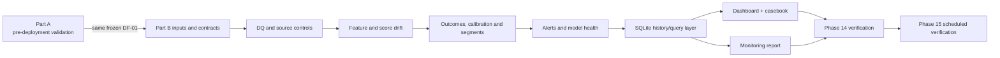
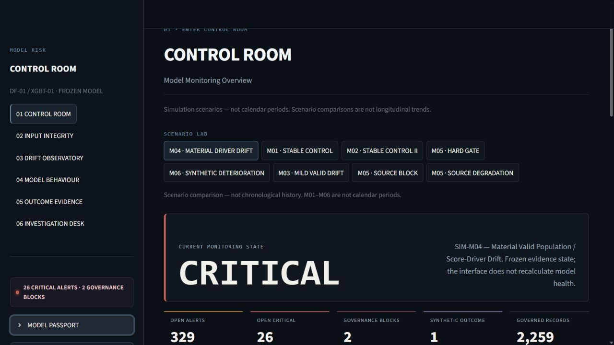
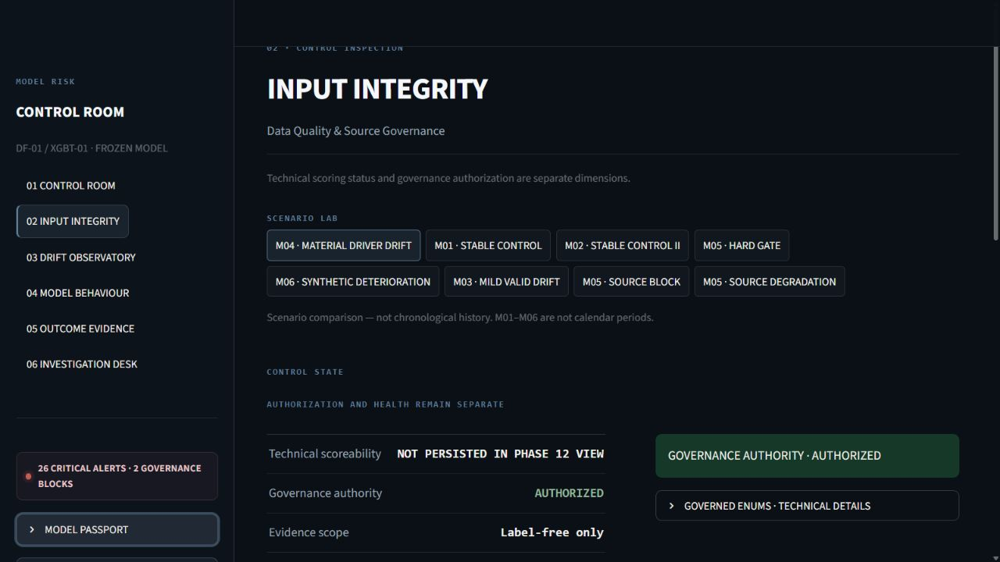
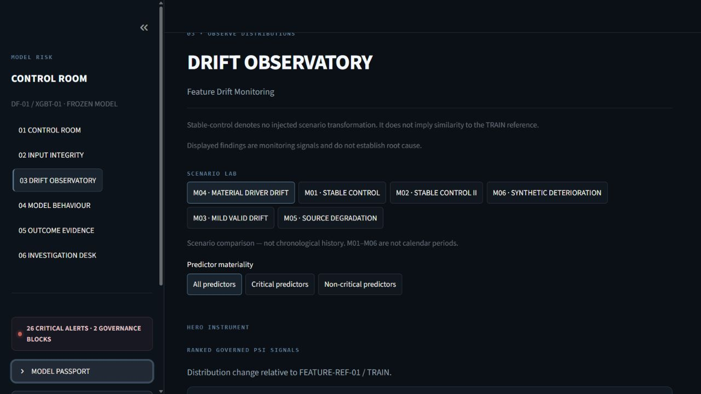
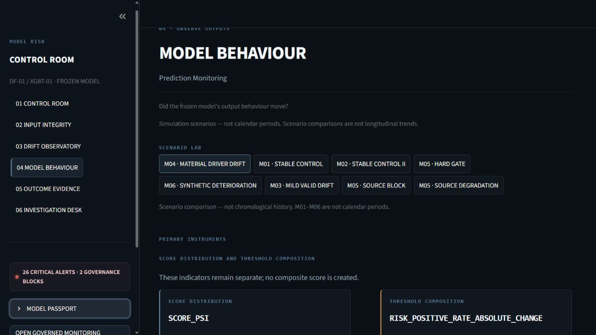
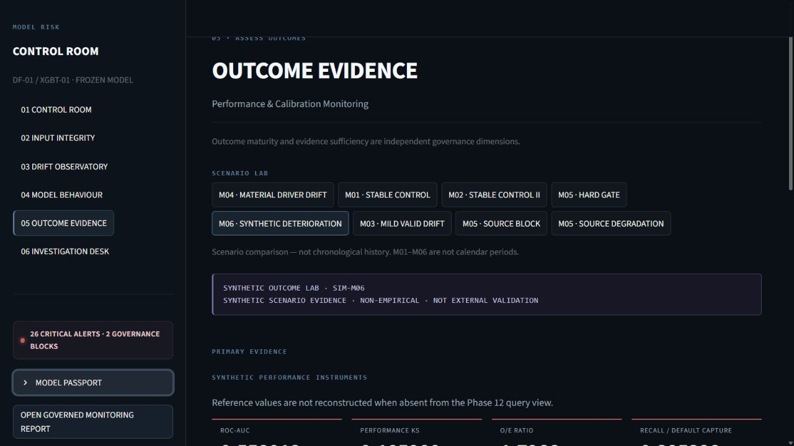
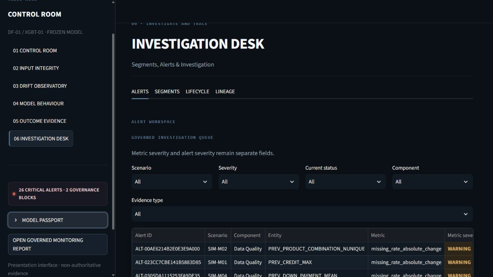

# Credit Risk Model Monitoring Platform

A governance-first, production-shaped monitoring platform for the frozen Part A credit-risk model `DF-01 / XGBT-01`.

Built as an end-to-end model-risk portfolio project, it joins data quality, drift, delayed-outcome performance, segments, alerts, SQLite history, Streamlit investigation, reporting and unattended verification around one immutable XGBoost model. Portfolio simulation; not production deployment.

> Release `1.0.0` — `APPROVED_FROZEN`. Phases 0–15 and the Project B implementation are complete. This remains a portfolio simulation and does not claim production deployment or external validation.

`INVESTIGATION-CASEBOOK-01` is approved and frozen as the authoritative project investigation assessment. Its four dossiers govern their own primary evidence records and preserve extraction-time status separately from the current Phase 12 alert state. The Phase 15 owner-completion decision is recorded in the final release evidence.

## What it demonstrates

- input-data quality and source-authority controls;
- population, feature, prediction and score drift;
- frozen-threshold decision monitoring;
- outcome maturity, discrimination and calibration eligibility;
- subpopulation monitoring with sufficiency gates;
- alert aggregation, escalation state and overall model health;
- persistent lineage, append-only alert lifecycle and query views;
- four consolidated investigation dossiers that trace governed alerts to evidence, limitations and monitoring dispositions;
- a six-page investigation dashboard and governed HTML/PDF report;
- an authored Model Risk Evidence System with numbered lifecycle navigation, a persistent passport, scenario artifacts, a signal-spectrum topology, THRESHOLD-01 boundary motif, dossiers and lineage;
- demand-rendered chart/investigation instruments plus governed 12/25/50-row pagination for large evidence ledgers;
- scheduler-safe frozen verification with locks, receipts and stable exit codes.

## Important scope

This is a portfolio and model-risk demonstration using simulated production-shaped cohorts. `DF-01` was not granted production approval and is not represented as deployed.

The Home Credit `application_test` population is unseen but unlabelled. It can support data-quality, feature-drift and score-distribution monitoring, but cannot independently validate discrimination, calibration, realised default performance or transportability. M06 performance results are synthetic scenario evidence. Genuinely unseen labelled external/OOT data remains required; `CND-02` is open.

## Frozen model dependency

| Item | Binding |
|---|---|
| Development freeze | `DF-01` |
| Model | `XGBT-01` / `xgbt01_raw_threshold01_df_v1` |
| Probability | raw `P(TARGET=1)` |
| Decision | `THRESHOLD-01`: probability `>= 0.080` |
| Part A commit | `0f758a8ee76906b2a870ebacbdcac0ef6c951485` |
| Part A repository | [credit-risk-model-validation-suite](https://github.com/Sidhharthhegde/credit-risk-model-validation-suite) |

The fitted model stays in the governed local Part A workspace and is not copied here. [`contracts/part_a_binding.json`](contracts/part_a_binding.json) defines the dependency.

## Architecture



Frozen phase artifacts remain authoritative. SQLite, dashboard, report and execution receipts are derived operational or presentation layers and cannot reinterpret upstream evidence. See [architecture](docs/ARCHITECTURE.md) and [governance](docs/GOVERNANCE.md).

## Monitoring lifecycle and scenarios

Phases 0–4 freeze protocol, runtime, reference roles, label-free adaptation and reference statistics. Phases 5–10 apply six simulated production-shaped cohorts (`M01`–`M06`) to data quality, drift, prediction, maturity-gated performance/calibration and frozen subpopulations. Phases 11–15 add alerts, overall health, persistence, investigation, reporting, lifecycle qualification and unattended verification.

Scenario IDs are not calendar periods. M01/M02 are stable controls; M03 introduces mild valid population drift; M04 introduces material score-driver drift; M05 covers data-quality and source-governance failure states; M06 carries synthetic outcomes for non-empirical performance deterioration. The project does not infer temporal trends from them.

## Key governed results

- 8 monitoring run representations, 2,259 normalized metric records and 329 frozen source alerts;
- 12 segment families and 32 frozen segment levels;
- 21 M06 segment discrimination rows eligible and 11 insufficient; 26 threshold rows eligible and 6 insufficient;
- blocked source/hard-gate runs remain `NOT_ASSESSABLE`, not automatically `CRITICAL`;
- 4 governed investigation dossiers reconcile 21 linked alert records without changing alert lifecycle state;
- The final Phase 15 regression suite and owner-completion decision are recorded in `PROJECT-RELEASE-01`.

These are portfolio simulation results, not empirical production estimates.

## Public and local artifacts

| Artifact | Public repository | Governed local environment |
|---|---:|---:|
| Source, contracts/configs and tests | Yes | Yes |
| Aggregate monitoring evidence | Yes | Yes |
| Aggregate investigation casebook | Yes | Yes |
| Dashboard source and sanitized screenshots | Yes | Yes |
| Frozen HTML/PDF monitoring report | Yes | Yes |
| Raw Home Credit data | No | Yes |
| Fitted model binary | No | Part A only |
| Row-level predictions/outcomes | No | Yes |
| SQLite runtime database | No | Generated locally |
| Qualification replay and scheduled receipts | No | Generated locally |

## Quick start

Create a Python 3.12 environment and install the pinned dependencies:

```powershell
python -m pip install -r requirements-lock.txt
```

## Public dashboard

The repository includes a Streamlit Community Cloud entrypoint at `streamlit_app.py`. Hosted mode rebuilds an ephemeral Phase 12 query database from the committed frozen aggregate evidence and opens it read-only, so visitors cannot mutate alert lifecycle state. See [public deployment](docs/PUBLIC_DEPLOYMENT.md).

Run the public-safe release checks:

```powershell
python scripts/verify_public_release.py
python -m pytest -q tests/release/test_public_release.py
```

Run the complete local test suite (governed local inputs required):

```powershell
python -m pytest
```

Run scheduler-safe frozen verification:

```powershell
python scripts/run_scheduled_monitoring.py --profile VERIFY_FROZEN
```

Verify the frozen Phase 14 lifecycle/report without recalculation:

```powershell
python scripts/run_monitoring_lifecycle.py --mode verify-frozen
```

Rebuild the governed local history store when its excluded inputs are available:

```powershell
python scripts/run_phase12_qualification.py
```

Run the local dashboard:

```powershell
python scripts/run_phase13_dashboard.py
```

Full local qualification requires the sibling frozen Part A workspace, excluded governed data and the ignored Phase 12 database. A fresh public clone does not reproduce those restricted inputs. See [reproducibility](docs/REPRODUCIBILITY.md) and [scheduled execution](docs/SCHEDULED_EXECUTION.md).

## Repository map

```text
contracts/   prospective governance and interface contracts
configs/     frozen monitoring and display policies
src/         monitoring, persistence, dashboard, reporting and scheduling code
tests/       analytical, control, orchestration and release tests
reports/     sanitized aggregate authoritative/qualification evidence
schemas/     receipt and SQLite schemas
deployment/  placeholder scheduler examples
docs/        architecture, governance, reproducibility and release guidance
artifacts/   ignored governed local runtime outputs
```

The frozen presentation artifact is available as [HTML](reports/monitoring_report/MONITORING-REPORT-01/monitoring_report.html) and [PDF](reports/monitoring_report/MONITORING-REPORT-01/monitoring_report.pdf). It is derived and non-authoritative; its source evidence remains frozen in the phase packages.

## Visual tour

The release package contains only sanitized aggregate views; no applicant-level data is shown.

| Control Room | Input Integrity |
|---|---|
|  |  |

| Drift Observatory | Model Behaviour |
|---|---|
|  |  |

| Outcome Evidence | Investigation Desk |
|---|---|
|  |  |

The earlier dashboard, drift and alert candidate screenshots remain in `docs/assets` as the pre-control-room visual baseline. The frozen monitoring-report preview is unchanged.

## Documentation

- [Implementation plan](docs/PROJECT_IMPLEMENTATION_PLAN.md)
- [Monitoring policy](MONITORING_POLICY.md)
- [Change-control policy](CHANGE_CONTROL_POLICY.md)
- [Architecture](docs/ARCHITECTURE.md)
- [Governance](docs/GOVERNANCE.md)
- [Reproducibility](docs/REPRODUCIBILITY.md)
- [Scheduled execution](docs/SCHEDULED_EXECUTION.md)
- [1.0.0 release notes](docs/RELEASE_NOTES_v1.0.0.md)

## Limitations

- no production approval, deployment, service-level, IAM or regulatory-certification claim;
- no empirical external/OOT validation; `CND-02` remains open;
- no fairness certification;
- synthetic M06 outcomes are not production performance;
- threshold-boundary-density monitoring remains `CONTROLLED_DEFERRED`;
- public CI verifies only the tracked public surface, not full monitoring execution.

## Licence

Code is licensed under the MIT License, copyright Sidharth Ravindra Hegde. Dataset files remain subject to their original terms and are not relicensed by this repository.
